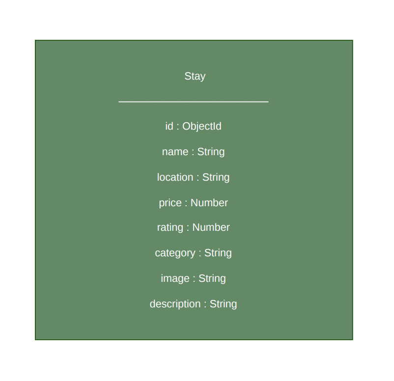

# RaahiStay Backend API

A simple REST API built using Node.js and Express.js for the RaahiStay project.

## Features

- Get all stays
- Get a single stay by ID
- Add a new stay
- Update an existing stay
- Delete a stay
- Search stays by location
- MongoDB Atlas Integration
- Mongoose ODM
- CRUD Operations
- Search by Location
- Environment Variable Support
- Proper HTTP Status Codes
- MongoDB Atlas
- Mongoose

## Tech Stack
 - Node.js
- Express.js
- MongoDB Atlas
- Mongoose
- CORS
- Dotenv
- Nodemon

## Installation

### 1. Clone the repository

```bash
git clone <repository-url>
```

### 2. Go to backend folder

```bash
cd backend
```

### 3. Install dependencies

```bash
npm install
```

### 4. Create a .env file

```env
PORT=3001
```

### 5. Start the server

```bash
npm run dev
```

Server will run at:

```
http://localhost:3001
```

---
## Set Up the Database

1. Create a `.env` file inside the backend folder.

2. Add the following environment variables:

```env
PORT=3001
MONGO_URI=your_mongodb_connection_string
```

3. Replace `your_mongodb_connection_string` with your MongoDB Atlas connection string.

4. Start the server:

```bash
npm run dev
```

If the connection is successful, the terminal will display:

```
MongoDB Connected ✅
```
# API Endpoints

## Get All Stays

```
GET /api/stays
```

Response: **200 OK**

---

## Get Stay by ID

```
GET /api/stays/:id
```

Example:

```
GET /api/stays/1
```

Response: **200 OK**

If ID is not found:

```
404 Not Found
```

---

## Add New Stay

```
POST /api/stays
```

Example Body:

```json
{
  "name": "Lake View Villa",
  "location": "Nainital",
  "price": 4500
}
```

Response:

```
201 Created
```

---

## Update Stay

```
PUT /api/stays/:id
```

Example Body:

```json
{
  "price": 3500
}
```

Response:

```
200 OK
```

---

## Delete Stay

```
DELETE /api/stays/:id
```

Example:

```
DELETE /api/stays/2
```

Response:

```
200 OK
```

---

## Search Stay by Location

```
GET /api/search?location=manali
```

Response:

```
200 OK
```

---

## HTTP Status Codes Used

| Status Code | Meaning |
|-------------|---------|
| 200 | OK |
| 201 | Created |
| 404 | Not Found |

---
## Database

This project uses MongoDB Atlas as the cloud database.

Mongoose is used as the ODM (Object Data Modeling) library.

All homestay data is stored in MongoDB.
## Schema Diagram

The project contains one MongoDB collection named **Stay**.


## Author

Developed by Aditi as part of the AI-Assisted Full Stack Web Development Internship.